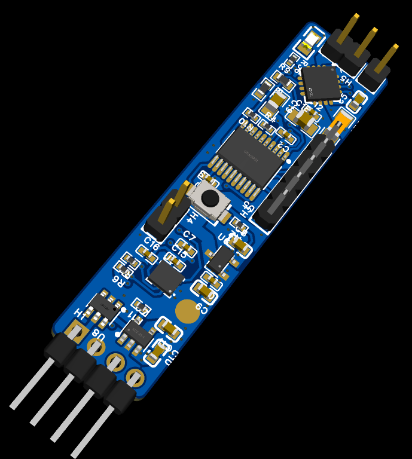
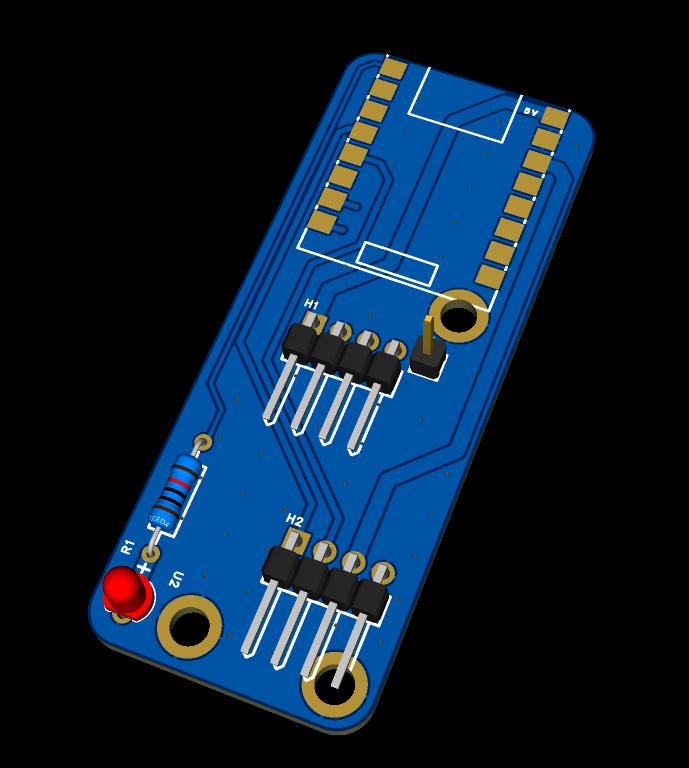
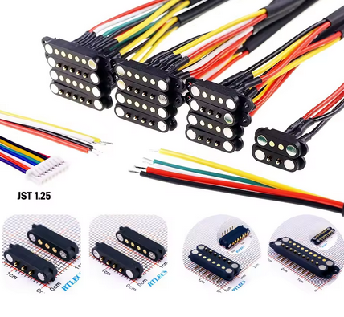
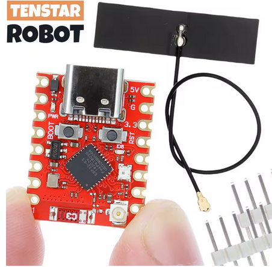
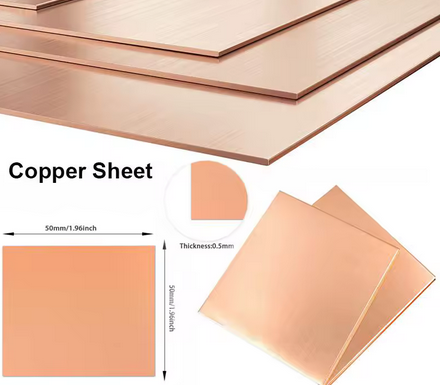
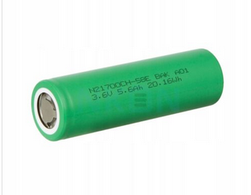

# Arsonbrush

Arsonbrush is a custom-made smart electric toothbrush, reusing a DC motor from a dead Oral-B toothbrush. 

## Why did I make this?

I was bored of $100+ dumb electric toothbrushes that have under-specced components to make them die faster.
For a bit of context, two well taken-care-of Oral-B toothbrushes stopped working, both with "exploded" resistors.
And also, ironically, whilst making this, ANOTHER ONE died on me.

I also noticed that there wasn't any open-source/DIY option.
So, may this toothbrush be the stepping stone for open-source electric toothbrushes in the future.

---
## Features!

- **Waterproof Charging**: Pogo pins!
- **Smart Base Station**: powered by ESP32C3
- **Huge Battery**: 5750mAh 21700 Li-Ion battery, do I need to say more?

(2+ years of runtime on a single charge, btw)

## Hardware Components

### Toothbrush Mainboard
- **MCU**: STM32C091FC
- **Motor Controller**: DRV8833RTYR dual H-bridge
- **IMU**: LSM6DSRTR 6-axis accelerometer/gyroscope
- **Charging IC**: MCP73831T-2ACI/OT (500mA charge rate)
- **Voltage Regulator**: MCP1700T-3302E/TT
- **Battery**: 21700 Li-Ion (5750mAh, BAK N21700CH-58E)
- **EMI Shield**: grounded 0.8mm copper sheet between motor and pcb

### Base Station
- **MCU**: Tenstar ESP32C3 SuperMini
- **Display**: Cheap I2C oled screen I have lying around
- **Connector**: 2A waterproof pogo pin connector pair
- **Status LED**: a status led

### 3D Model


## Toothbrush PCB!


## Base station PCB!





## Bill of Materials
### This is in addition to [the toothbrush PCBA BOM](pcb/bom-toothbrush.csv)

| Component | Quantity | Description | Supplier | Unit Cost | Total Cost (+shipping) | Image |
|-----------|----------|-------------|----------|-----------|------------------------|-------|
| Toothbrush PCB | 5, 2 PCBA |toothbrush handle mainboard | JLCPCB | Not applicable | 70 EUR | |
| Base board | 5 | Toothbrush base PCB | JLCPCB | 1 EUR | 5 EUR | |
| 2A Pogo pins connector pair | 1 pair | Waterproof connection | [Aliexpress](https://it.aliexpress.com/item/1005006525401310.html) | 5.89 EUR | 5.89 EUR | |
| Tenstar ESP32C3 supermini | 1 | Base MCU | [Aliexpress](https://it.aliexpress.com/item/1005009897797706.html) | 3.36 EUR | 3.36 EUR | |
| Copper sheet 0.8mm 50x50cm | 1 | Motor EMI protection plane | [Aliexpress](https://it.aliexpress.com/item/1005006915598911.html) | 3.69 EUR | 3.69 EUR | |
| 21700 battery | 1 | Toothbrush battery | [nkon.nl](https://www.nkon.nl/en/bak-n21700ch-58e-5750mah-11-2a.html) | 3.75 EUR | 9.14 EUR | |

**Total Project Cost:** 97.08 EUR

**Notes:**
- All costs are in EUR
- Quantities reflect MOQ

## File tree
```
arsonbrush/
├── 3d/                    # 3D models and case designs
├── code/arsonbrush/       # Firmware
│   ├── Core/Src           # Firmware source code
├── pcb/                   # EasyEDA PCB
│   ├── arsonBrush.eprj    # Complete project
│   ├── bom-toothbrush.csv # toothbrush PCBA BOM
│   ├── gerber-base.zip    # Base station gerbers
│   ├── gerber-toothbrush.zip # Toothbrush gerbers
│   ├── schematic-base.pdf # Base station schematic
│   └── schematic-toothbrush.pdf # Toothbrush schematic
├── datasheets/            # Component datasheets
└── README.md              # This file!
```

## Building the Toothbrush firmware

### Prerequisites
- Nix pakage manager
- ST-Link or compatible programmer

### Compilation
```bash
cd code/arsonbrush
nix-shell
make
```

### Flashing
Flash the generated `.bin/.hex` from `/build`


## License

This project is licensed under the [GNU General Public License v3.0](LICENSE).

## Acknowledgments

- Project developed as part of Hack Club Blueprint
- Awesome thanks to DragonSlayer and Adam Turaj for helping me make this!
